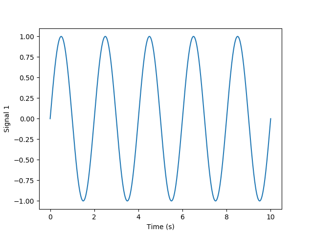
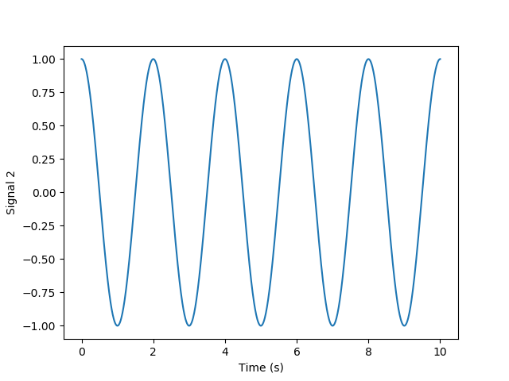

# README.md for Figures Created on 2020/08/28 at 14:59.29 PST. 

## Notes

(Add Notes Here.)

## Parameters 

```py
params = {
	'Time Step' : 0.01,
	'Signal Amplitude' : 1,
	'Signal Frequency' : 0.5,
	'Duration Of Signal' : 10
}
```

## Figures

<p align="center">
	</br>
	<small>Figure 1: Caption for Signal_figures_01-01.png.</small>
</p>
</br>
</br>

<p align="center">
	</br>
	<small>Figure 2: Caption for Signal_figures_01-02.png.</small>
</p>
</br>
</br>

